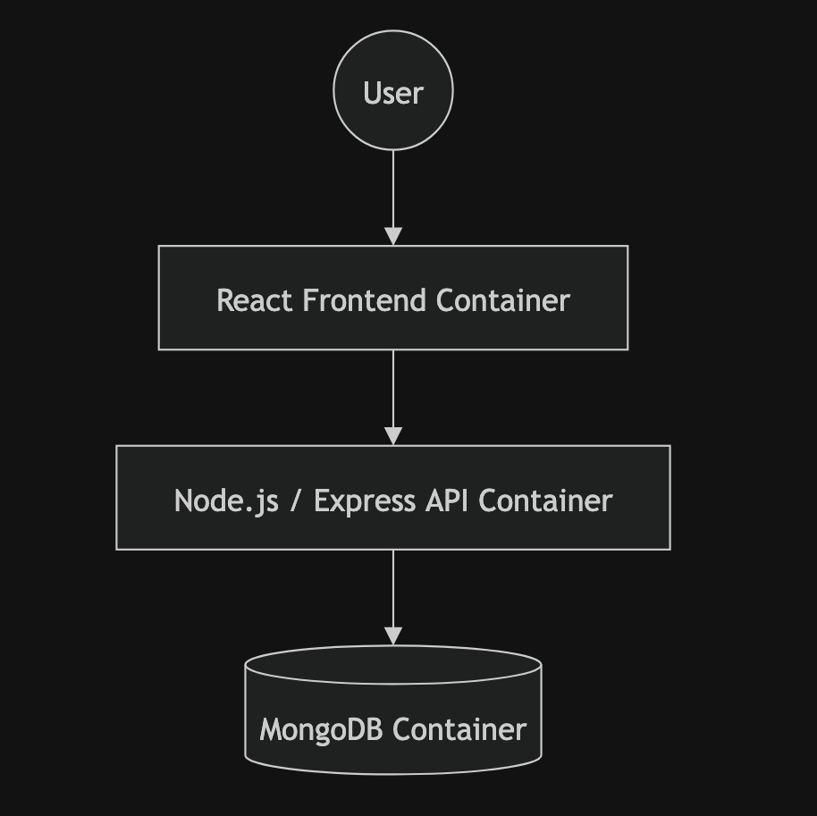

# Containerizing and Deploying a MERN Stack Application Using Docker Compose

## Project Overview

This project demonstrates how to containerize and deploy a three-tier MERN (MongoDB, Express, React, Node.js) application using Docker and Docker Compose.

The frontend, backend, and MongoDB database are packaged into separate containers and connected through a custom Docker network. Docker Compose is then used to orchestrate and deploy the entire application stack with a single command.

## Architecture



### Components

* **Frontend** – React application
* **Backend** – Node.js and Express API
* **Database** – MongoDB
* **Docker Compose** – Multi-container orchestration
* **Docker Network** – Service-to-service communication
* **Docker Volume** – Persistent MongoDB storage

## Technologies Used

* React
* Node.js
* Express.js
* MongoDB
* Docker
* Docker Compose

## Project Structure

```text
containerizing-deploying-MERN-app/

├── architecture/
│   └── architecture.png
│
├── docs/
│   ├── CLEANUP.md
│   └── HOWTO.md
│
├── mern/
│   ├── backend/
│   └── frontend/
│
├── screenshots/
│   ├── 01-app-running.png
│   ├── 02-compose-up.png
│   ├── 03-docker-ps.png
│   ├── 04-network.png
│   └── 05-mongo-volume.png
│
├── docker-compose.yml
└── README.md
```

## Screenshots

### Application Running


### Docker Compose Deployment


### Running Containers


### Docker Network


### MongoDB Volume


## Key Learnings

* Built custom Docker images for frontend and backend services
* Created and managed Docker networks for container communication
* Configured MongoDB as a separate database container
* Implemented persistent storage using Docker volumes
* Simplified multi-container deployment using Docker Compose
* Learned service discovery using container names instead of localhost

## Documentation

Detailed implementation steps can be found in:

* [HOWTO.md](docs/HOWTO.md)
* [CLEANUP.md](docs/CLEANUP.md)

