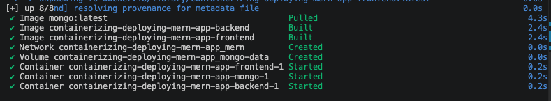
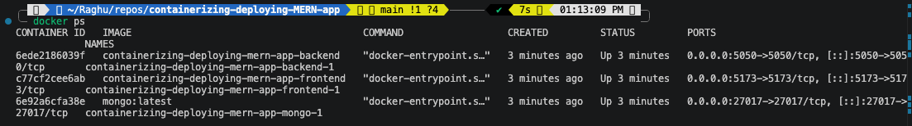
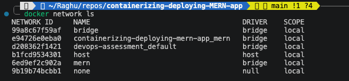
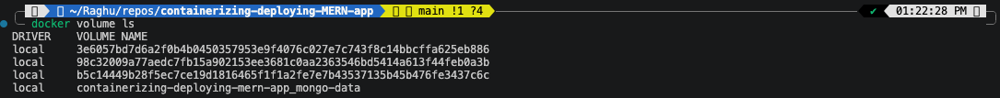
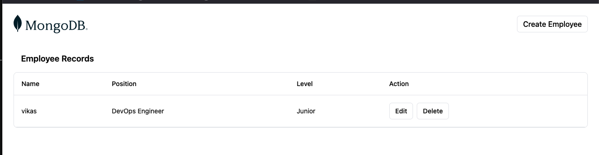

# How To Reproduce This Project

## Prerequisites

* Docker
* Docker Compose

Verify installation:

```bash
docker --version
docker compose version
```

---

## Step 1 - Create Frontend Dockerfile

Navigate to:

```bash
cd mern/frontend
```

Create a Dockerfile:

```dockerfile
FROM node:18.9.1

WORKDIR /app

COPY package.json .

RUN npm install

COPY . .

EXPOSE 5173

CMD ["npm","run","dev"]
```

Build the image:

```bash
docker build -t mern-frontend .
```

Run the container:

```bash
docker run --name frontend -p 5173:5173 mern-frontend
```

Verify:

```text
http://localhost:5173
```

---

## Step 2 - Create Docker Network

Create a custom network:

```bash
docker network create mern
```

Run frontend inside the network:

```bash
docker run \
--name frontend \
--network mern \
-d \
-p 5173:5173 \
mern-frontend
```

---

## Step 3 - Deploy MongoDB Container

Run MongoDB container:

```bash
docker run \
--network mern \
--name mongodb \
-d \
-p 27017:27017 \
-v mongo-data:/data/db \
mongo:latest
```

Verify:

```bash
docker ps
```

---

## Step 4 - Create Backend Dockerfile

Navigate to:

```bash
cd mern/backend
```

Create Dockerfile:

```dockerfile
FROM node:18.9.1

WORKDIR /app

COPY package.json .

RUN npm install

COPY . .

EXPOSE 5050

CMD ["npm","start"]
```

Build image:

```bash
docker build -t mern-backend .
```

Run container:

```bash
docker run \
--name backend \
--network mern \
-d \
-p 5050:5050 \
mern-backend
```

---

## Step 5 - Verify Application Connectivity

Validate:

Frontend → Backend → MongoDB

Expected result:

* Frontend loads successfully
* Backend API responds
* Records are inserted into MongoDB
* Data persists correctly

---

## Step 6 - Create docker-compose.yml

Instead of managing containers individually, create a Docker Compose file.

Deploy the entire application:

```bash
docker compose up -d
```



Verify:

```bash
docker ps
```

All containers should start automatically.

---

## Step 7 - Validate Deployment

Check running containers:

```bash
docker ps
```



Check networks:

```bash
docker network ls
```



Check volumes:

```bash
docker volume ls

```



Open application:

```text
http://localhost:5173
```



Confirm data is stored in MongoDB successfully.

